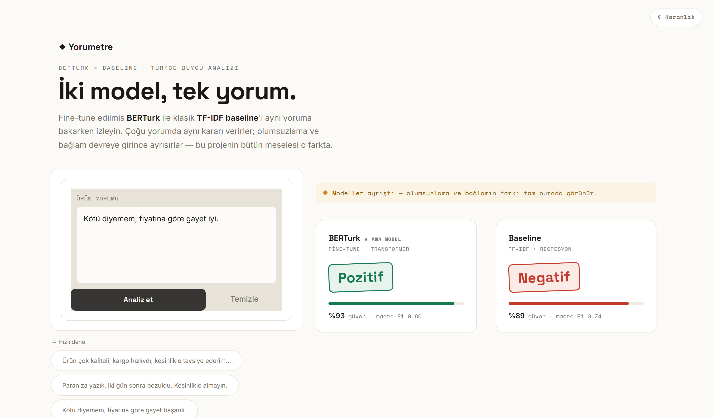
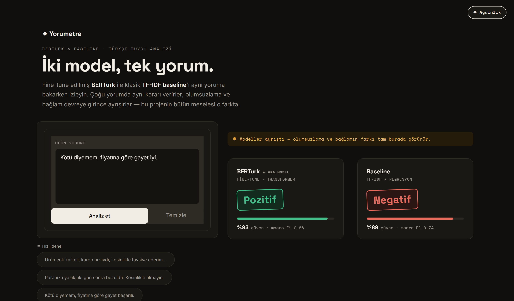
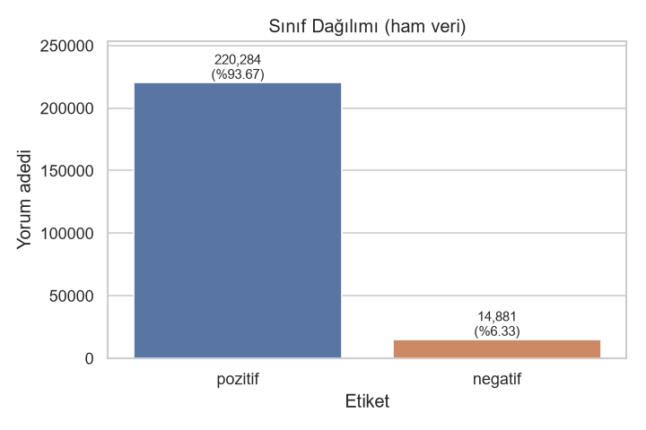
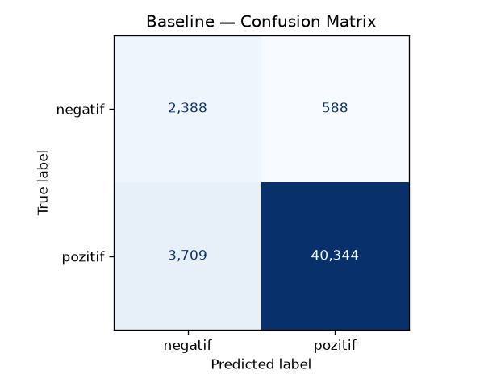
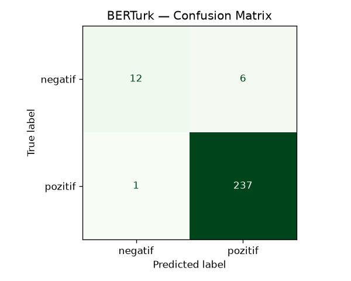

<div align="center">

# ◆ Yorumetre

**Türkçe ürün yorumu duygu analizi** — TF-IDF baseline → BERTurk fine-tuning,
dürüst değerlendirme ve iki modeli karşılaştıran canlı demo.

[🇬🇧 English README](README.en.md)

[](https://github.com/kucukenes17/turkce-urun-yorumu-duygu-analizi/actions/workflows/ci.yml)
[](https://www.python.org/)
[](https://scikit-learn.org/)
[](https://huggingface.co/Eneskck/berturk-turkish-product-sentiment)
[](app.py)
[](LICENSE)

**Macro-F1: `0.74` (baseline) → `0.86` (BERTurk)** &nbsp;·&nbsp; aynı test kümesinde



_Aynı yorumda iki modelin ayrıştığı an: BERTurk "Pozitif", baseline "Negatif" — olumsuzlamanın farkı._

</div>

---

## 🎯 Özet

Bu proje, ~235 bin gerçek Türkçe ürün yorumu üzerinde **iki yaklaşımı** kıyaslar ve
sonuçları **dürüstçe** raporlar:

| Model | Yaklaşım | Accuracy | **Macro-F1** | Negatif F1 |
|:------|:---------|:--------:|:------------:|:----------:|
| Baseline | TF-IDF + Lojistik Regresyon | 0.9086 | 0.7379 | 0.5264 |
| **BERTurk** 🏆 | `dbmdz/bert-base-turkish-cased` fine-tune | **0.9688** | **0.8630** | **0.7425** |

> **BERTurk baseline'ı +0.125 macro-F1 ile geçti.** En büyük kazanım, verinin
> yalnızca %6'sını oluşturan **azınlık (negatif) sınıfında**.

**Neden accuracy değil, macro-F1?** Veri seti ~%94 pozitif. Her şeye "pozitif"
diyen naif bir model %93.7 accuracy alır ama negatif sınıfta tamamen işe yaramaz.
Bu yüzden asıl ölçüt **macro-F1** + confusion matrix.

---

## ✨ Öne çıkan örnek: bağlamın önemi

Aynı yoruma iki modelin verdiği yanıt, transformer'ın neden kazandığını özetliyor:

> _"Kötü diyemem, fiyatına göre gayet iyi."_ &nbsp;(aslında **olumlu**)

| Model | Tahmin | Doğru mu? |
|:------|:-------|:---------:|
| Baseline (kelime torbası) | Negatif %99 | ❌ ("kötü" kelimesini görüp yanılıyor) |
| **BERTurk** | Pozitif %77 | ✅ (olumsuzlamayı anlıyor) |

---

## 🚀 Demo

Yorum yazıp **iki modelin tahminini yan yana** gör:

```bash
pip install -r requirements.txt
python app.py            # tarayıcı: http://127.0.0.1:7860
```

`app.py` + `requirements.txt` kök dizinde olduğu için Hugging Face **Spaces**'e
doğrudan yüklenebilir. Model Hub'dan otomatik çekilir:
[`Eneskck/berturk-turkish-product-sentiment`](https://huggingface.co/Eneskck/berturk-turkish-product-sentiment).

Arayüzün aydınlık ve karanlık teması var:

| Aydınlık | Karanlık |
|:--:|:--:|
|  |  |

---

## 📊 Veri Seti

[`fthbrmnby/turkish_product_reviews`](https://huggingface.co/datasets/fthbrmnby/turkish_product_reviews)
— ~235.165 gerçek Türkçe ürün yorumu, ikili etiket (`0 = negatif`, `1 = pozitif`).

**En kritik özellik: veri seti ciddi dengesiz** (~%94 pozitif). Tüm modelleme
kararları (stratified bölme, class weight, macro-F1) bu gerçeğe göre alındı.

<div align="center">

</div>

---

## 🧪 Sonuçlar & Confusion Matrix

Her iki model de **aynı** stratified %80/%20 bölme (`random_state=42`) ve **aynı**
test kümesi (47.029 yorum) üzerinde değerlendirildi.

| Baseline (TF-IDF + LogReg) | BERTurk (fine-tuned) |
|:--:|:--:|
|  |  |

Baseline azınlık sınıfta çok sayıda yanlış alarm üretirken (negatif precision 0.39),
BERTurk bunu 0.78'e çıkarıyor — daha az yanlış, daha güvenilir tahmin.

---

## 🔍 Hata Analizi (dürüst değerlendirme)

`python -m src.error_analysis` (baseline) ve `python -m src.evaluate_berturk`
(BERTurk) yanlışları inceler. İki tür hata öne çıkıyor:

1. **Modelin gerçekten zorlandığı vakalar** — olumsuzlama ("kötü **değil**"),
   karışık yorumlar ("güzel **ama** kırılgan"), alay. Baseline kelime torbası
   olduğu için bunları kaçırır; **BERTurk büyük ölçüde çözer**.
2. **Veri setindeki etiket gürültüsü** — "gayet güzel, tavsiye ederim" gibi
   açıkça olumlu bazı yorumlar veride "negatif" etiketli. Bu, modelin değil
   **etiketin** hatası; yıldız-puanı → etiket eşlemesinin bir sınırlaması ve
   raporlanan tavan başarıyı bir miktar aşağı çeker.

Detaylar: [`outputs/error_analysis.md`](outputs/error_analysis.md),
[`outputs/berturk_report.md`](outputs/berturk_report.md).

---

## ⚙️ Kurulum & Çalıştırma

```bash
python -m venv .venv
# Windows:        .\.venv\Scripts\Activate.ps1
# Linux/macOS:    source .venv/bin/activate
pip install -r requirements.txt
```

```bash
python -m src.data_loader        # veriyi indir + parquet önbelleğe al
python -m src.explore            # EDA: dağılım, uzunluk, örnekler, grafikler
python -m src.baseline           # baseline eğit + değerlendir + kaydet
python -m src.error_analysis     # baseline hatalarını incele
python -m src.evaluate_berturk   # Hub'daki BERTurk'ü test kümesinde değerlendir
python app.py                    # Gradio demo (iki model yan yana)
```

BERTurk fine-tuning ise Colab'da yapılır → [`notebooks/berturk_finetuning.ipynb`](notebooks/berturk_finetuning.ipynb).

---

## 🗂️ Proje Yapısı

```
src/
  config.py            # sabitler, yollar, etiket eşlemeleri (tek kaynak)
  data_loader.py       # HF'ten indir, önbelleğe al, DataFrame döndür
  explore.py           # keşifçi veri analizi (EDA) + grafikler
  baseline.py          # TF-IDF + Lojistik Regresyon
  error_analysis.py    # baseline hatalarını kategorize eder + örnekler
  evaluate_berturk.py  # BERTurk'ü test kümesinde değerlendirir + confusion matrix
app.py                 # Gradio demo (BERTurk vs baseline; aydınlık/karanlık tema)
notebooks/
  berturk_finetuning.ipynb   # Colab GPU fine-tuning (+ opsiyonel HF Hub yükleme)
scripts/
  screenshot_demo.py   # demonun ekran görüntülerini üretir (Playwright)
tests/                 # hızlı smoke testleri (pytest)
docs/images/           # README görselleri (grafikler + demo)
outputs/               # üretilen raporlar
MODEL_CARD.md          # HF Hub model kartı
README.en.md           # İngilizce README
```

Tüm bölmeler `random_state=42` ile deterministik; baseline ve BERTurk **birebir
aynı** eğitim/test verisini görür → adil karşılaştırma.

---

## 🧱 Teknoloji

`Python 3.13` · `scikit-learn` · `Hugging Face Transformers` · `datasets` ·
`PyTorch` · `Gradio` · `pandas` · `matplotlib` / `seaborn`

---

## ⚠️ Sınırlamalar

- **Etiket gürültüsü:** etiketler yıldız puanından türetildiği için bir kısmı
  metinle çelişiyor (bkz. Hata Analizi).
- **Dengesiz veri:** ~%94 pozitif; azınlık sınıf performansı asıl darboğaz.
- **Kapsam:** yalnızca ikili (pozitif/negatif); nötr sınıf veya aspect yok.
- BERTurk modeli boyutu nedeniyle repoda değil; HF Hub'dan çekilir / notebook ile üretilir.

---

## 🗺️ Yol Haritası

- [x] Proje iskeleti + veri yükleme + EDA
- [x] TF-IDF + Lojistik Regresyon baseline
- [x] BERTurk fine-tuning (Colab, macro-F1 0.86)
- [x] Değerlendirme + hata analizi + confusion matrix'ler
- [x] Gradio demo (iki model karşılaştırmalı) + HF Hub'a model yükleme
- [ ] Demoyu HF Spaces'e yayınlama (canlı link)
- [ ] Aspect-based sentiment ("neyin hakkında pozitif/negatif")
- [ ] Etiket gürültüsünü temizleyip yeniden değerlendirme

---

## 📄 Lisans

[MIT](LICENSE) — özgürce kullanılabilir.

<div align="center">
<sub>Baseline'sız derin modele geçme; kıyas noktası şarttır. — proje prensibi</sub>
</div>
